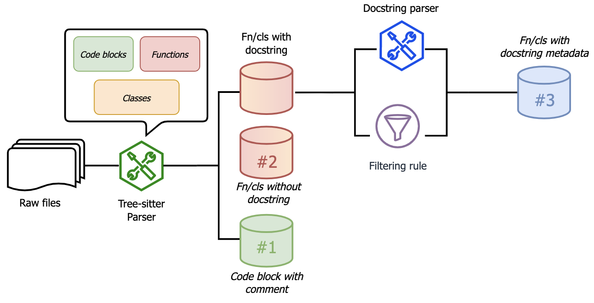

<div align="center">

<p align="center">
  
</p>

[](https://opensource.org/licenses/MIT) [](https://www.python.org/downloads/release/python-380/) [](https://arxiv.org/abs/2305.06156) [](https://huggingface.co/datasets/Fsoft-AIC/the-vault-function) 

# The Vault: A Comprehensive Multilingual Dataset for Advancing Code Understanding and Generation
</div>

## Table of content
- [The Vault Dataset](#the-vault-dataset)
  - [Data Summary](#data-summary)
  - [Data Structure](#data-structure)
    - [Data Instance](#data-instances)
    - [Data Fields](#data-fields)
    - [Data Near Deduplication](#data-near-deduplication)
    - [Splitting Train/Eval/Test](#splitting-trainevaltest)
    - [Splitting Train set](#splitting-trainset-into-multiple-subsets)
  - [Download Dataset](#download-dataset)
    - [Download Data from Azure blob storage](#download-data-from-azure-blob-storage)
    - [Load dataset from huggingface hub](#load-dataset-from-huggingface-hub)
- [The Vault toolkit](#the-vault-toolkit)
  - [Getting Started](#getting-started)
  - [Processing Pipeline](#processing-pipeline)
    - [Extracting raw code](#extracting-raw-code)
    - [Filtering extracted code snippet](#filtering-extracted-code-snippet)
    - [Processing Custom Dataset](#processing-custom-dataset)
- [Citing The Vault](#citing-the-vault)
- [Contact Us](#contact-us)
- [License](#license)

___________


# The Vault Dataset
## Data Summary
The Vault dataset is a comprehensive, large-scale, multilingual parallel dataset that features high-quality code-text pairs derived from The Stack, the largest permissively-licensed source code dataset.

We provide The Vault which contains code snippets from 10 popular programming languages such as Java, JavaScript, Python, Ruby, Rust, Golang, C#, C++, C, and PHP. This dataset provides multiple code-snippet levels, metadata, and 11 docstring styles for enhanced usability and versatility.


## Data Structure
### Data Instances
Every sample of The Vault are stored in form of a json object and compressed into a large json line file. Each sample corresponds to one raw code file. The content of the file are used to extracting function, class and inline set, other information (repository name, licenses, etc) are collected from source dataset (The Stack).

### Data Fields
See detail of data fields and example for each type of set [Here](./data/README.md)

### Data Near-Deduplication
We applied deduplication for internal and external.

- **Internal**: Apply exact deduplicate in full dataset.
- **External**: Apply near deduplicate with the test sets of CodeSearchNet, HumanEval and APPS.

*[Near-deduplication](https://chenghaomou.github.io/posts/20230220150602) use MinHash LSH to clustering sample based on their code. Those sample are close to each other (or even modified version) can be detected.

### Splitting train/eval/test
We have divided the complete dataset into three distinct sets: a training set, an evaluation set, and a test set, to maintain consistency throughout the experiment.

To avoid data leakage, we allocated all samples from the same repository to a singular set. We then subdivided these sets using code tokens as splitting factors. As a result, these subsets mirror the distribution of the full dataset.

<details>
  <summary>Function set</summary>
  <table>
    <thead>
      <tr>
        <th>Language</th>
        <th>Train set  (w/ docstring)</th>
        <th>Eval set (w/ docstring)</th>
        <th>Test set (w/ docstring)</th>
        <th>Train set (w/o docstring)</th>
        <th>Eval set (w/o docstring)</th>
        <th>Test set (w/o docstring)</th>
      </tr>
    </thead>
    <tbody>
      <tr>
        <td>Python</td>
        <td>10,015,689</td>
        <td>20,000</td>
        <td>20,000</td>
        <td>29,125,850</td>
        <td>20,000</td>
        <td>20,000</td>
      </tr>
      <tr>
        <td>PHP</td>
        <td>5,512,811</td>
        <td>20,000</td>
        <td>20,000</td>
        <td>24,730,767</td>
        <td>20,000</td>
        <td>20,000</td>
      </tr>
      <tr>
        <td>JavaScript</td>
        <td>2,610,895</td>
        <td>20,000</td>
        <td>20,000</td>
        <td>30,324,762</td>
        <td>20,000</td>
        <td>20,000</td>
      </tr>
      <tr>
        <td>Java</td>
        <td>7,990,528</td>
        <td>20,000</td>
        <td>20,000</td>
        <td>61,673,653</td>
        <td>20,000</td>
        <td>20,000</td>
      </tr>
      <tr>
        <td>C#</td>
        <td>4,052,737</td>
        <td>20,000</td>
        <td>20,000</td>
        <td>31,604,009</td>
        <td>20,000</td>
        <td>20,000</td>
      </tr>
      <tr>
        <td>C++</td>
        <td>1,941,459</td>
        <td>20,000</td>
        <td>20,000</td>
        <td>26,662,941</td>
        <td>20,000</td>
        <td>20,000</td>
      </tr>
      <tr>
        <td>C</td>
        <td>1,976,979</td>
        <td>20,000</td>
        <td>20,000</td>
        <td>11,706,009</td>
        <td>20,000</td>
        <td>20,000</td>
      </tr>
      <tr>
        <td>Go</td>
        <td>5,643,975</td>
        <td>20,000</td>
        <td>20,000</td>
        <td>18,108,788</td>
        <td>20,000</td>
        <td>20,000</td>
      </tr>
      <tr>
        <td>Rust</td>
        <td>1,053,679</td>
        <td>20,000</td>
        <td>20,000</td>
        <td>7,096,896</td>
        <td>20,000</td>
        <td>20,000</td>
      </tr>
      <tr>
        <td>Ruby</td>
        <td>544,038</td>
        <td>20,000</td>
        <td>20,000</td>
        <td>3,718,153</td>
        <td>20,000</td>
        <td>20,000</td>
      </tr>
      <tr>
        <td>Total</td>
        <td>41,342,790</td>
        <td>200,000</td>
        <td>200,000</td>
        <td>244,751,828</td>
        <td>200,000</td>
        <td>200,000</td>
      </tr>
    </tbody>
    </table>
</details>

### Splitting trainset into multiple subsets
Given the substantial size of our dataset, we found it beneficial to further divide the training set into two smaller subsets for ease of experimentation:

- A small training set, which contains 5% of the total data.
- A medium training set, comprising 20% of the full dataset.
- (And) the full training set.

<details>
    <summary>Function set:</summary>
    <table class="tg">
    <thead>
      <tr>
        <th class="tg-7btt">Subset</th>
        <th class="tg-7btt">Language</th>
        <th class="tg-7btt">With docstring</th>
        <th class="tg-7btt">Without docstring</th>
      </tr>
    </thead>
    <tbody>
      <tr>
        <td class="tg-4erg">Small (5%)</td>
        <td class="tg-0pky">Python</td>
        <td class="tg-0pky">500,784</td>
        <td class="tg-0pky">1,456,293</td>
      </tr>
      <tr>
        <td class="tg-0pky"></td>
        <td class="tg-0pky">PHP</td>
        <td class="tg-0pky">275,641</td>
        <td class="tg-0pky">1,236,538</td>
      </tr>
      <tr>
        <td class="tg-0pky"></td>
        <td class="tg-0pky">JavaScript</td>
        <td class="tg-0pky">130,545</td>
        <td class="tg-0pky">1,516,238</td>
      </tr>
      <tr>
        <td class="tg-0pky"></td>
        <td class="tg-0pky">Java</td>
        <td class="tg-0pky">399,526</td>
        <td class="tg-0pky">3,083,683</td>
      </tr>
      <tr>
        <td class="tg-0pky"></td>
        <td class="tg-0pky">C#</td>
        <td class="tg-0pky">202,637</td>
        <td class="tg-0pky">1,580,200</td>
      </tr>
      <tr>
        <td class="tg-0pky"></td>
        <td class="tg-0pky">C++</td>
        <td class="tg-0pky">97,073</td>
        <td class="tg-0pky">1,333,147</td>
      </tr>
      <tr>
        <td class="tg-0pky"></td>
        <td class="tg-0pky">C</td>
        <td class="tg-0pky">98,849</td>
        <td class="tg-0pky">585,300</td>
      </tr>
      <tr>
        <td class="tg-0pky"></td>
        <td class="tg-0pky">Go</td>
        <td class="tg-0pky">282,199</td>
        <td class="tg-0pky">905,439</td>
      </tr>
      <tr>
        <td class="tg-0pky"></td>
        <td class="tg-0pky">Rust</td>
        <td class="tg-0pky">52,684</td>
        <td class="tg-0pky">354,845</td>
      </tr>
      <tr>
        <td class="tg-0pky"></td>
        <td class="tg-0pky">Ruby</td>
        <td class="tg-0pky">27,202</td>
        <td class="tg-0pky">185,908</td>
      </tr>
      <tr>
        <td class="tg-0pky"></td>
        <td class="tg-0pky">Total</td>
        <td class="tg-0pky">2,067,140</td>
        <td class="tg-0pky">12,237,591</td>
      </tr>
      <tr>
        <td class="tg-4erg">Medium(25%)</td>
        <td class="tg-0pky">Python</td>
        <td class="tg-0pky">2,503,922</td>
        <td class="tg-0pky">7,281,463</td>
      </tr>
      <tr>
        <td class="tg-0pky"></td>
        <td class="tg-0pky">PHP</td>
        <td class="tg-0pky">1,378,203</td>
        <td class="tg-0pky">6,182,692</td>
      </tr>
      <tr>
        <td class="tg-0pky"></td>
        <td class="tg-0pky">JavaScript</td>
        <td class="tg-0pky">652,724</td>
        <td class="tg-0pky">7,581,191</td>
      </tr>
      <tr>
        <td class="tg-0pky"></td>
        <td class="tg-0pky">Java</td>
        <td class="tg-0pky">1,997,632</td>
        <td class="tg-0pky">15,418,413</td>
      </tr>
      <tr>
        <td class="tg-0pky"></td>
        <td class="tg-0pky">C#</td>
        <td class="tg-0pky">1,013,184</td>
        <td class="tg-0pky">7,901,002</td>
      </tr>
      <tr>
        <td class="tg-0pky"></td>
        <td class="tg-0pky">C++</td>
        <td class="tg-0pky">485,365</td>
        <td class="tg-0pky">6,665,735</td>
      </tr>
      <tr>
        <td class="tg-0pky"></td>
        <td class="tg-0pky">C</td>
        <td class="tg-0pky">494,245</td>
        <td class="tg-0pky">2,926,502</td>
      </tr>
      <tr>
        <td class="tg-0pky"></td>
        <td class="tg-0pky">Go</td>
        <td class="tg-0pky">1,410,994</td>
        <td class="tg-0pky">4,527,197</td>
      </tr>
      <tr>
        <td class="tg-0pky"></td>
        <td class="tg-0pky">Rust</td>
        <td class="tg-0pky">263,420</td>
        <td class="tg-0pky">1,774,224</td>
      </tr>
      <tr>
        <td class="tg-0pky"></td>
        <td class="tg-0pky">Ruby</td>
        <td class="tg-0pky">136,010</td>
        <td class="tg-0pky">929,538</td>
      </tr>
      <tr>
        <td class="tg-0pky"></td>
        <td class="tg-0pky">Total</td>
        <td class="tg-0pky">10,335,698</td>
        <td class="tg-0pky">61,187,957</td>
      </tr>
    </tbody>
    </table>
</details>

<details>
  <summary>Class set:</summary>
  Updating
</details>

<details>
  <summary>Inline set</summary>
  Updating
</details>

## Download dataset
### Load dataset

We publish [The Vault](https://huggingface.co/datasets/Fsoft-AIC/the-vault-function) on Huggingface dataset hub.

```python
from datasets import load_dataset

# Load full function level dataset (40M samples)
dataset = load_dataset("Fsoft-AIC/the-vault-function")

# Load function level train/validation/test set
dataset = load_dataset("Fsoft-AIC/the-vault-function", split_set=["train"])

# Load "small" (or "medium", "full") function level training set
dataset = load_dataset("Fsoft-AIC/the-vault-function", split_set=["train/small"])

# specific language (e.g. Python) 
dataset = load_dataset("Fsoft-AIC/the-vault-function", split_set=["train"], languages=['Python'])

# dataset streaming
data = load_dataset("Fsoft-AIC/the-vault-function", split_set= ["train"])
for sample in iter(data['train']): 
    print(sample)
```
### Download via link

Or download the Vault directly from Azure blob storage via download link. Here are the link pattern for specific download option:
> https://ai4code.blob.core.windows.net/thevault/v1/{function,class,inline}/{python,java,javascript,go,cpp,c_sharp,c,rust,ruby,php}.zip

For example, download *class* of *Python*:
> https://ai4code.blob.core.windows.net/thevault/v1/class/python.zip

Or download using the script [`download_dataset.py`](./resources/download_dataset.py):
```bash
python download_dataset.py "<path/to/destination>" --set "function" # or class/inline
```

# The Vault Toolkit
## Getting Started

To setup environment and install dependencies via `pip`:
```bash
pip -r install requirements.txt
```

Install `codetext` parser to extract code using [tree-sitter](https://tree-sitter.github.io/tree-sitter/), via `pip`:
```bash
pip install codetext
```

Or manually build `codetext` form source, see more at [`Codetext` repo](https://github.com/FSoft-AI4Code/CodeText-parser)
```bash
git clone https://github.com/FSoft-AI4Code/CodeText-parser.git
cd CodeText-parser
pip install -e .
```

## Processing Pipeline
Our toolkit takes raw source code files as input and streamlines the extraction and generation of
code-text pairs, as illustrated in Figure above.
There are 3 seperate process:
1. **Extracting Raw code:** By using Tree-sitter extractor to identify function/class/line node inside raw file and obtain their metadata
2. **Extracting Docstring Style:** We implement a docstring style parser to capture all the informative section or param's description inside a docstring
3. **Filtering Docstring:** From the docstring gathered from previous process, we use it as main factor to filter quality sample (remove empty docstring, uninformative docstring, etc). See more about cleaning methodologies at our [paper](https://arxiv.org/abs/2305.06156)

We seperated the source code into multiple steps (coresponde for each process). Or you can run the full pipeline follow [this tutorial](#processing-custom-dataset).


### Extracting Raw code
From raw code, you can extract function, class using [`process_raw_node()`](./src/utils/utils.py#L138). An example structure of a raw code snippet show in the figure below. Inside a node are identifier, parameter or argument list, code and comment (docstring). 

```python
from codetext.utils import parse_code
from codetext.parser import PythonParser

code_snippet = """
def sum2num(a: int, b: int):
  '''
  :param a: first number
  :param b: second number
  '''
  return a + b # result
"""
code_tree = parse_code(code_snippet, 'cpp')

res = process_raw_node(
    tree=code_tree, 
    blob=code_snippet,
    language_parser=PythonParser(),
    metadata={'repo': 'test'}  # Optional
)

# or extrating line

res = get_line_definitions(
    tree=code_tree, 
    blob=code_snippet,
    language_parser=PythonParser(),
    source_metadata={'repo': 'test'}  # Optional
)
```

For extracting raw inline comment, the function [`get_line_definitions()`](./src/utils/utils.py#L279) can help to extract line comment and return the parent code block, previous and next context (i.e. code block).

```python
from codetext.utils import parse_code
from codetext.parser import PythonParser

code_snippet = """
def sum2num(a: int, b: int):
  '''
  :param a: first number
  :param b: second number
  '''
  return a + b
"""
code_tree = parse_code(code_snippet, 'cpp')

res = process_raw_node(
    tree=code_tree, 
    blob=code_snippet,
    language_parser=PythonParser(),
    metadata={'repo': 'test'}  # Optional
)
```


### Filtering Extracted code snippet
With the result function or class node and their metadata extracted from previous process, execute [`get_node_definitions()`](./src/utils/utils.py#L238) to filtering sample based on their docstring. Heuristic rules will remove sample that not meet the minimum requirement (We detailedly describe it inside our 
).


Lastly, to extracting docstring style we implement a function call [`extract_docstring()`](./src/utils/utils.py#L514) that take docstring (in form of string) as input and result metadata of the docstring style as demonstrate in the figure above (e.g. param's docstring, type, return's docstring, etc.)


### Processing Custom Dataset
We create a `.yaml` to define which field to load when processing data. Usually, only source code are needed, but in case there are other additional information about the raw code might be added using the `.yaml`.

For example, `CodeSearchNet` stores their data in structure:

```yaml
# CodeSearchNet jsonline format 
# https://github.com/github/CodeSearchNet#data-details

code: original_string # raw code
repo: repo # additional infor
path: path # additional infor
language: language # additional infor
```
Inside `processing.py` we merged extracting raw code, filtering docstring and extracting docstring style function into 1 simple pipeline for quickly extracting dataset from raw source data. You can use `processing.py` by:
```bash
python -m codetext.processing 
<DATASET_PATH>
--save_path <SAVE_PATH>  # path to save dir

--load_from_file  # load from file instead load from dataset cache
--language Python  # or Java, JavaScript, ...
--data_format './data/format/codeparot-format.yaml'  # load raw data format

--n_split 20  # split original dataset into N subset
--n_core -1  # number of multiple processor (default to 1) (-1 == using all core)
```

Arguments list:
```
positional arguments:
  data_path             data folder contain file.jsonl or huggingface dataset cache

options:
  -h, --help            show this help message and exit
  --save_path SAVE_PATH
                        Processed data save path
  --level LEVEL         Extract function/class/inline level or all
  --language LANGUAGE   Declare processing language (e.g: Python, Java)
  --data_format DATA_FORMAT
                        Path to file .yaml contains data format
  --load_from_file      Load from .json or .jsonl
  --cons_from_raw       Continues from raw .jsonl (pass folder path to data)
  --raw_only
  --filtered_only
  --extracted_only
  --n_split N_SPLIT     Split all the raw data into N file and feed into process pool
  --n_core N_CORE       Number of maximum process to create
  --debug
```

# Citing The Vault
More details can be found in our [paper](https://arxiv.org/abs/2305.06156). 

If you're using The Vault or the toolkit in your research or applications, please cite using this BibTeX:
```bibtex
@article{manh2023vault,
  title={The Vault: A Comprehensive Multilingual Dataset for Advancing Code Understanding and Generation},
  author={Manh, Dung Nguyen and Hai, Nam Le and Dau, Anh TV and Nguyen, Anh Minh and Nghiem, Khanh and Guo, Jin and Bui, Nghi DQ},
  journal={arXiv preprint arXiv:2305.06156},
  year={2023}
}
```

# Contact us
If you have any questions, comments or suggestions, please do not hesitate to contact us.
- Website: [fpt-aicenter](https://www.fpt-aicenter.com/ai-residency/)
- Email: support.ailab@fpt.com

# License
[MIT License](LICENSE.txt)
